# The Moovie App

Comme expliqué par mail, suite a des problèmes de droit sur le git, nous avons dû créer un repo à part.

## Démo

### Fonctionnalités

- [x] Catégories de films
- [X] Catégories de séries
  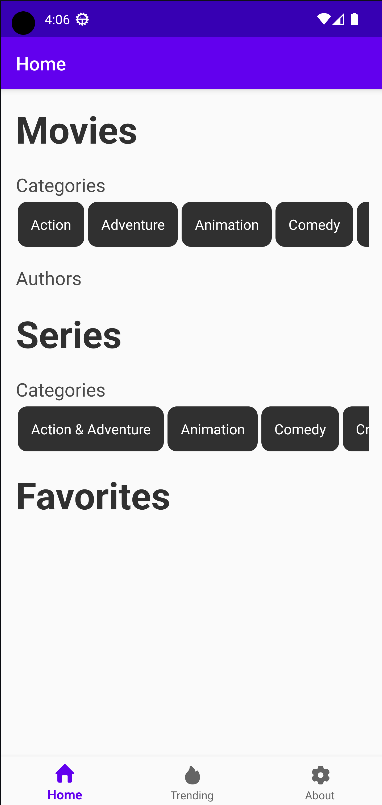

- [x] Liste des films par catégories
  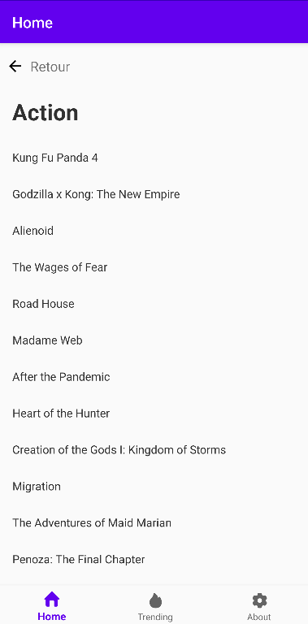

- [X] Liste des films par auteurs
  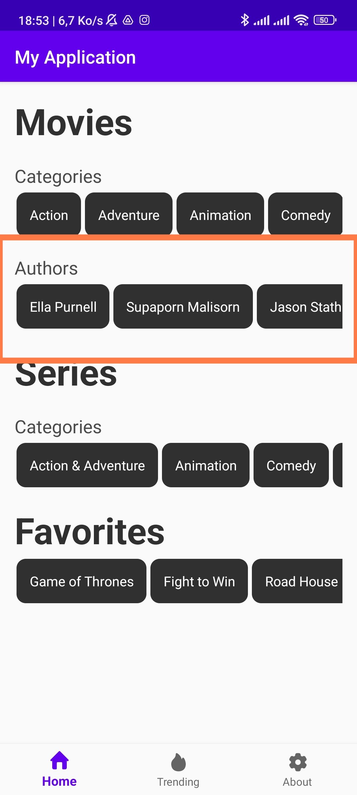\
  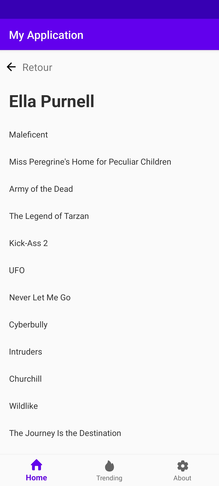
- [x] Détails des films
  \
  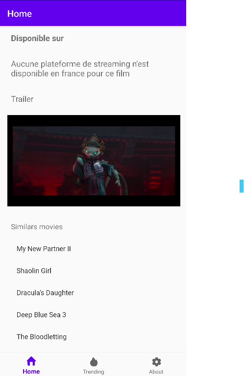

- [X] Détails des séries
  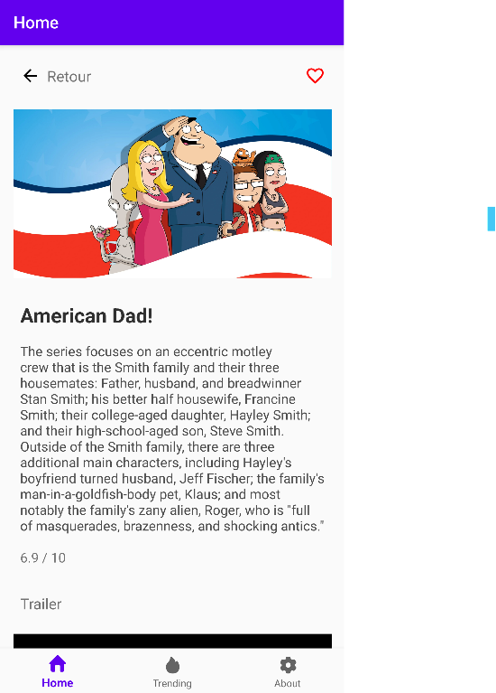\
  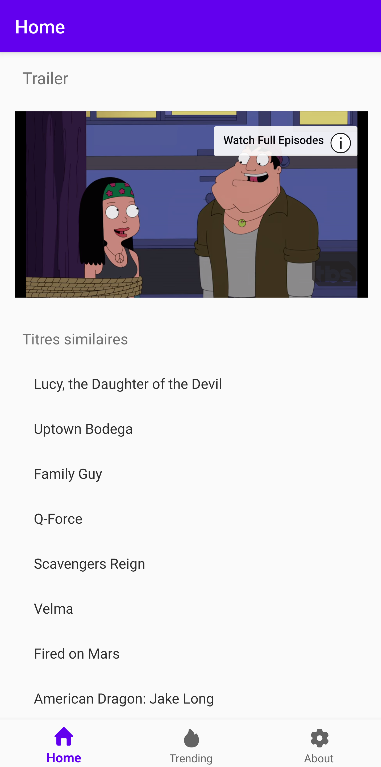

- [x] Films à la une
- [X] Séries à la une
  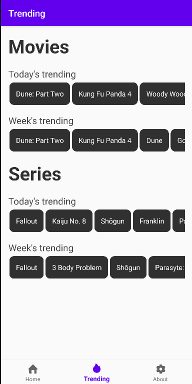\

- [X] Visualiser la bande annonce d'un film ou d'une série
  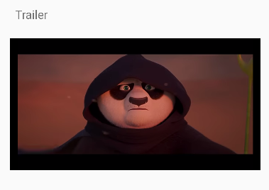\

- [X] Liste de films et séries en favoris (géré dans une base de données locale)
  \
  

- [x] Une vue A propos contenant les fonctionalités de l'application, le profile LinkedIn des membres du groupe, le listing des librairies utilisées, ...\
  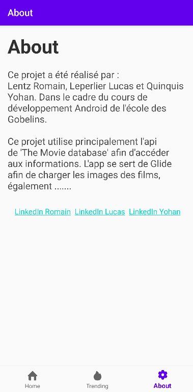 \

- [x] Voir la liste des plateformes pour regarder un film
  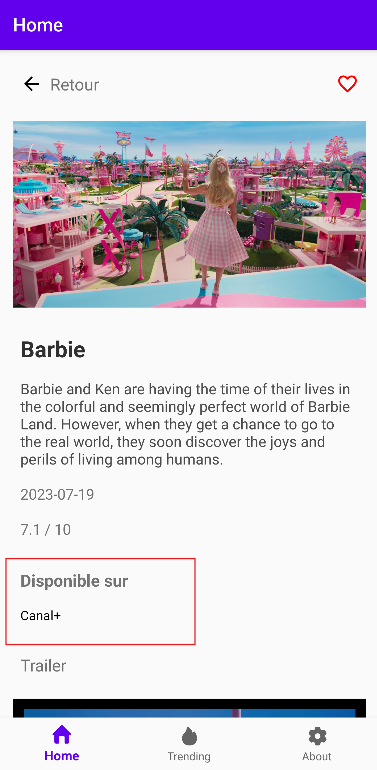\

- [x] Une navigation bar pour naviguer d'une page a l'autre
  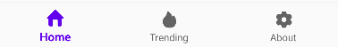\

